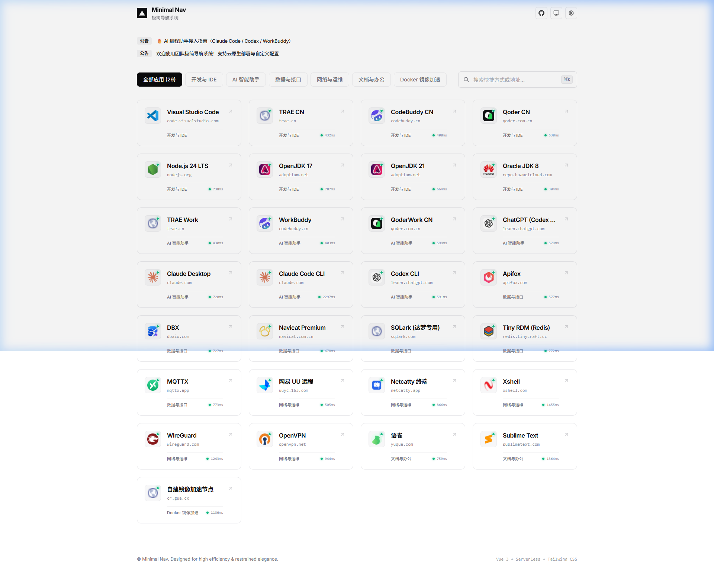
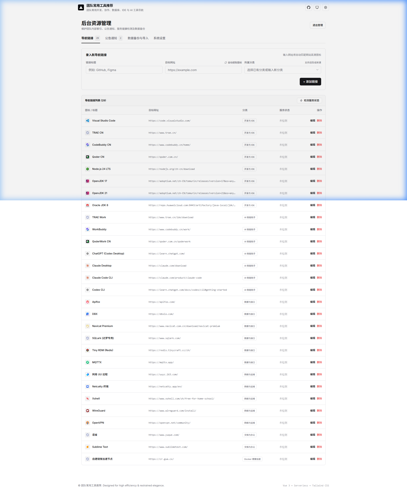

# Minimal Nav

极简冷峻风格的现代化个人与团队导航系统。提供 **Cloudflare Serverless 云原生全托管** 与 **单二进制（Single Binary）零依赖私有化自建** 两种运行形态，兼顾公网极速访问与内网数据私密性。

🌐 **线上演示站点**：[https://nav.gua.cx/](https://nav.gua.cx/)

---

## 📸 界面预览

### 1. 导航主页 (Swiss & Editorial Line Layout)


### 2. 后台管理控制台 (shadcn 规范与 Combobox 分类器)


---

## ✨ 核心特性

- **冷峻极简美学**：遵循瑞士出版物排版（Swiss Line Layout），采用极细边框分割、无衬线字体与等宽字阶点缀，克制且无冗余视觉干扰。
- **双模部署支持**：
  - **Cloudflare Serverless 模式**：基于 Pages + Functions (Hono) + D1 (分布式 SQLite)，零服务器成本，全球 CDN 边缘毫秒级响应。
  - **单二进制 0 依赖模式**：Go 内嵌前端编译，单文件（~20MB）双击即运行，内置 SQLite 驱动，无需安装 Node.js / Nginx / Docker。
  - **轻量 Docker 模式**：多阶段构建生成单容器极简镜像（~20MB）。
- **链接与分类管理**：支持可视化排序、置顶、高清 Favicon 自动探测提取与实时 HTTP 连通性检测。
- **3 行垂直公告栏**：平滑分页轮播通知，支持 Markdown 详情弹窗与独立页面在线编辑。
- **数据备份与导入**：
  - 支持全量 JSON 数据导出与还原。
  - 原生兼容 Chrome / Edge / Firefox 导出的 HTML 书签文件，支持一键分类解析导入。
- **系统设置与备案号**：支持自定义站点名称、副标题描述及工信部 ICP 备案号直达跳转。

---

## 🏛️ 系统架构

### 1. 本地 / 私有服务器单二进制运行模式 (`master` 分支)
```
                    ┌──────────────────────────────────────────────┐
                    │          单一二进制可执行文件 minimal-nav        │
                    │                                              │
  用户浏览器  ──────> │  ├── 内嵌前端资源 (Vue 3 SPA)                │
 (访问 :8080)        │  ├── 后端 API 引擎 (Gin 路由)                 │
                    │  └── 纯 Go SQLite 驱动 (无 CGO 依赖)          │
                    └──────────────────────┬───────────────────────┘
                                           │ 自动读写
                                           ▼
                                本地 SQLite (nav.db)
```

### 2. Cloudflare Serverless 模式 (`cloudflare-serverless` 分支)
```
[ 用户浏览器 ]
      │
[ Cloudflare 边缘网络 ]
   ├── [ Cloudflare Pages (Vue 3 静态前端) ]
   └── [ Pages Functions (Hono API - /api/*) ]
            │
       [ Cloudflare D1 (分布式 SQLite) ]
```

---

## 🚀 部署指南

### 方案 A：单二进制 0 依赖一键运行（本地 / 独立 VPS 推荐）

直接下载预编译二进制文件或本地编译：

```bash
# 1. 一键打包编译单二进制文件 (Windows 生成 minimal-nav.exe，Linux 生成 minimal-nav)
go run scripts/build.go

# 2. 运行服务
./minimal-nav
```

服务启动后将自动在同级目录读写 `nav.db`，在浏览器打开 `http://127.0.0.1:8080` 即可使用。

---

### 方案 B：Cloudflare Serverless 部署（云端全托管，0 成本）

#### 1. 初始化 D1 数据库
1. 登录 Cloudflare 控制台，进入 **存储和数据库** -> **D1 SQL 数据库**，创建名为 `minimal-nav-db` 的数据库。
2. 进入控制台 (Console)，复制项目中的 `d1/schema.sql` 执行，完成数据表结构与初始精选数据导入。

#### 2. 关联部署 Pages
1. 在控制台进入 **Workers 和 Pages** -> **创建应用程序** -> **Pages** -> **连接到 Git**。
2. 选择本仓库（分支选择 `cloudflare-serverless`），配置构建参数：
   - 框架预设：`Vite`
   - 根目录：`frontend`
   - 构建命令：`npm run build`
   - 输出目录：`dist`
3. 保存并部署。

#### 3. 绑定 D1 与管理口令
1. 进入该 Pages 项目的 **设置** -> **函数 (Functions)**。
2. 添加 **D1 数据库绑定**：变量名设为 `DB`（大写），选择 `minimal-nav-db`。
3. 添加 **环境变量**：变量名设为 `ADMIN_PASSWORD`，填入管理密码（默认 `admin123`）。
4. 重新部署即可上线。

---

### 方案 C：Docker 单容器部署

```bash
# 启动轻量容器
docker compose up -d
```
访问地址：`http://localhost:8080`。

---

## 📁 目录结构

```
minimal-nav/
├── backend/             # Go 后端源码与内嵌静态资源服务
├── frontend/            # Vue 3 极简前端源码
├── docs/images/         # 界面预览截图
├── d1/schema.sql        # Cloudflare D1 数据表结构与种子数据
├── scripts/build.go     # 单二进制一体化打包构建脚本
├── Dockerfile           # 极简单镜像多阶段构建文件
├── docker-compose.yml   # 极简单容器配置
└── package.json
```

---

## 📄 开源协议

[MIT License](LICENSE)
